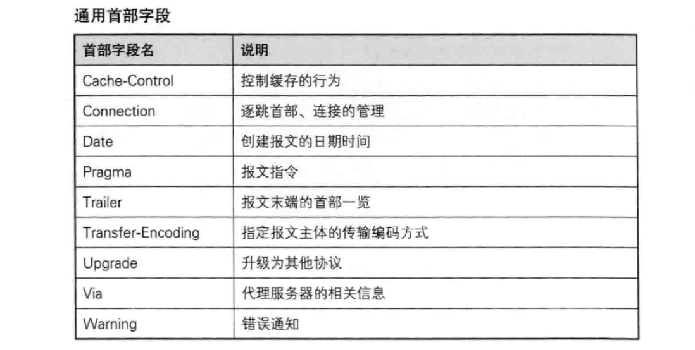
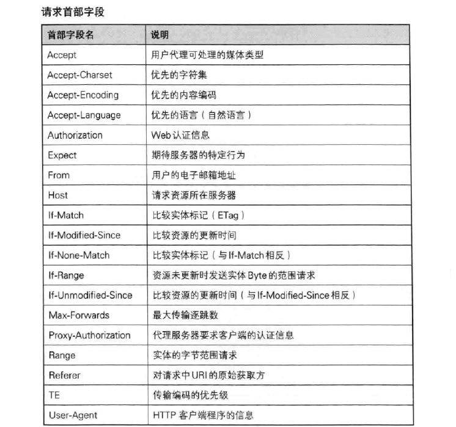
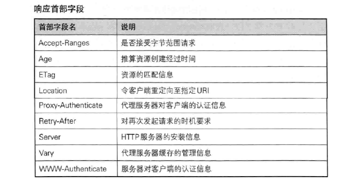
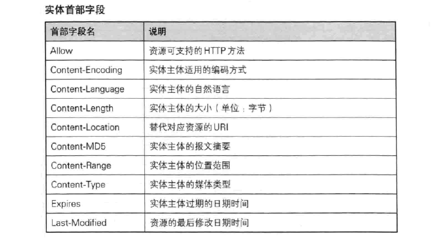
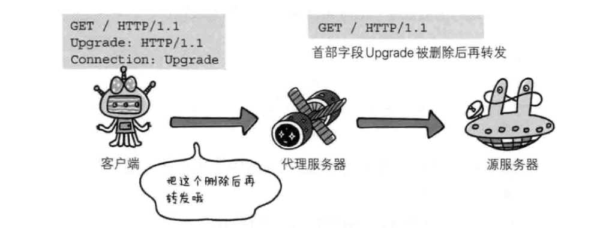
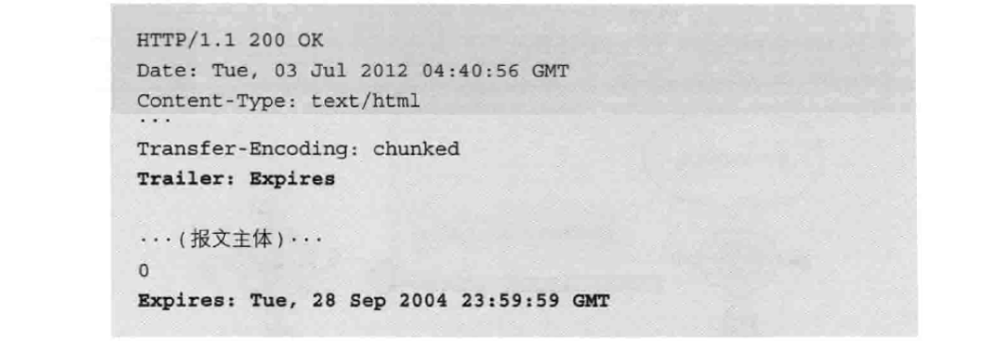
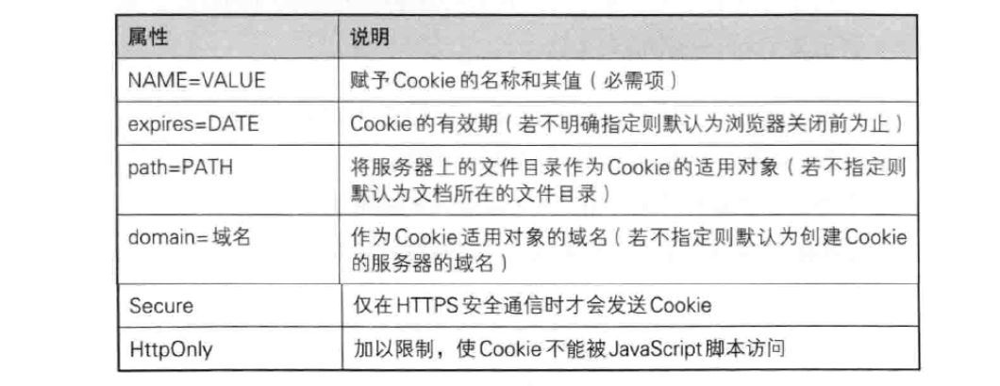

# HTTP首部
HTTP协议中，请求和响应必定包含HTTP首部。他们起到传递额外信息的作用。如主体大小，使用的语言，认证信息等。首部字段根据使用用途分为4类：
* 通用首部字段：
    请求报文和响应报文都会使用的首部。
* 请求首部字段
    请求报文使用的首部。
* 响应首部字段
    响应报文使用的首部。
* 实体首部字段
    正对请求报文或是响应报文实体部分使用的首部。

HTTP/1.1中规定了47种首部字段：  
通用首部：

请求首部：

响应首部：

实体首部：

### 通用首部
1. Cache-Control:  
用于操作缓存的工作机制。
2. Connection:  
connection有两个作用：
    * 控制不再转发给代理的字段
    
    图中控制字段upgrade进过代理服务器后不再被转发
    * 管理持久连接
    connection字段值为keep-alive表示持久连接，值为close则断开连接
3. Date:  
表示创建HTTP报文的日期和时间。
4. Pragma:  
历史遗留版本，只有唯一的定义形式：Pragma: no-cache。虽然是通用字段，但是只在请求报文中出现，客户端要求所有中间服务器不返回缓存资源，一般和Cache-Control：no-cache同时使用。
5. Trailer:  
事先说明报文主体后记录了哪些首部字段。用在分块传输是。

首部中指定了Trailer值为Expires，主体最后（分块长度为0之后）出现字段Expires。
6. Transfer-Encoding:  
规定传输报文主体时采用的编码方式、
7. Upgrade:  
用于检测HTTP协议及其他协议是否可用更高的版本通信。
8. Via:  
Via字段可用来追踪客户端和服务器之间请求和响应报文的传输路径。
9. Warning:  
告知用户一些与缓存相关的问题警告。

### 请求首部
1. Accept:  
通知服务器客户端能处理的媒体类型及媒体类型的优先级。
2. Accept-Charset:  
通知服务器用户代理支持的字符集以及字符集的优先顺序。
3. Accept-Encoding:  
告知服务器用户代理支持的内容编码以及内容编码优先级，
4. Accept-Language:  
告知服务器用户代理能处理的自然语言集以及他们的优先级。
5. Authorization:  
告知服务器用户代理的认证信息。
6. Expect:  
告知服务器期望出现的某种特定行为。
7. From:  
告知服务器用户代理的用户的电子邮件地址。
8. Host:  
告知服务器请求资源所在的主机名和端口号。
9. If-Match:  
请求首部中If-xxx形式的首部都称为条件首部。服务器接收条件首部后，只有判断条件为真才执行请求。
If-Match告知服务器资源所用的实体标记ETag值，服务器对比If-Match值和资源的ETag值，仅当两者一致时才执行请求。否则返回412 Precondition Failed响应。
10. If-Modified-Since:  
在该字段指定的日期时间之后，如果资源更新过，则执行请求，否则返回304 Not Modified响应。
11. If-None-Match:  
与If-Match作用相反。
12. If-Range:  
告知服务器，如果指定的If-Range值和请求的资源的ETag或时间一致时，作为范围请求处理，否则返回全部资源。
13. If-Unmodified-Since:  
与If-Modified-Since作用相反。
14. Max-forwords:  
表示可经过的服务器的最大数目。服务器在往下一个服务器转发前，会先将Max-forwords的值减一。当服务器收到的请求的Max-forwords的值为0时，不再进行转发，而是直接返回响应。
15. Proxy-Authorization:  
接受从代理服务器发来的认证质询是，客户端发送包含Proxy-Authorization字段的请求来告知服务器认证需要的信息。
16. Range:  
需要获取部分资源请求时，用Range字段告知服务器资源的指定范围。
17. Referer:  
告知服务器请求的原始资源的URI。
18. TE:  
告知服务器客户端能处理响应的编码方式和优先级，用于传输编码。
19. User-Agent:  
告知服务器创建请求的浏览器和用户代理的名称等信息。

### 响应首部
1. Accept-Ranges:  
告知服务器能否处理范围请求，如果值为bytes表示能处理，如果为none表示不能处理。
2. Age:  
告知客户端源服务器在多久前创建了响应。单位秒。
3. ETag:  
告知客户端实体标记。服务器为每份资源分配对应的ETag值，在资源更新时，ETag值也需要更新。有强弱之分：
    * 强ETag:不论实体发生多么细微的变换都会改变它的值。
    * 弱ETag:只有资源发生根本改变才会改变它的值。
4. Location:  
将响应接收方引导至某个与请求不同的URI资源，配合3xx重定向响应，提供重定向的URI。几乎所有浏览器收到包含Location的响应后，都会强制性的尝试对重定向资源的访问。
5. Proxy-Authenticate:  
Proxy-Authenticate把代理服务器所要求的认证信息发送给客户端。
6. Retry-After:  
告知客户端应该在多久后再次发送请求。
7. Server:  
告知客户端当前服务器上安装的HTTP服务器应用程序的信息。
8. Vary:  
Vary用来对缓存进行控制。
9. WWW-Authenticate:  
用户HTTP的访问认证。告知客户端用于访问请求URI所指定资源的认证方案。

### 实体首部
1. Allow:  
用于通知客户端能够支持的HTTP方法。
2. Content-Encoding:  
告知客户端对实体部分选用的编码方式。
3. Content-Language:  
告知客户端实体部分使用的自然语言。
4. Content-Length:  
表名实体主体部分大小。
5. Content-Location:  
指实体主体部分对应的URI。表示报文主体返回资源的URI。
6. Content-MD5:  
该字段是一串由MD5算法生成的值，用于检查报文主体在传输过程中是否保持完整以及确认传输到达。
7. Content-Renge:  
告知客户端响应返回的实体的范围。
8. Content-Type:  
说明了实体主体内对象的媒体类型。
9. Expires:  
将资源的失效日期告知客户端。
10. Last-Modified:  
指资源的最后修改日期。

### Cookie首部字段
1. Set-Cookie:  
当服务器开始管理客户端状态时，会事先告知各种信息。  
Set-Cookie字段的属性：

2. Cookie:  
当客户端想获得HTTP状态管理支持时，就会在请求中包含从服务器接收发到的Cookie。

### 其他首部字段
在HTTP等多种协议中，给非标准参数加上X-前缀来和标准参数区别开。但是这种简单粗暴的做法不值得提倡。
