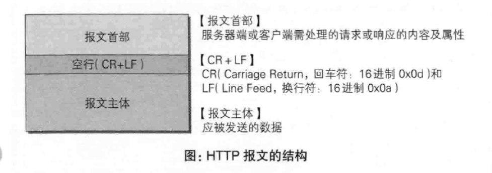
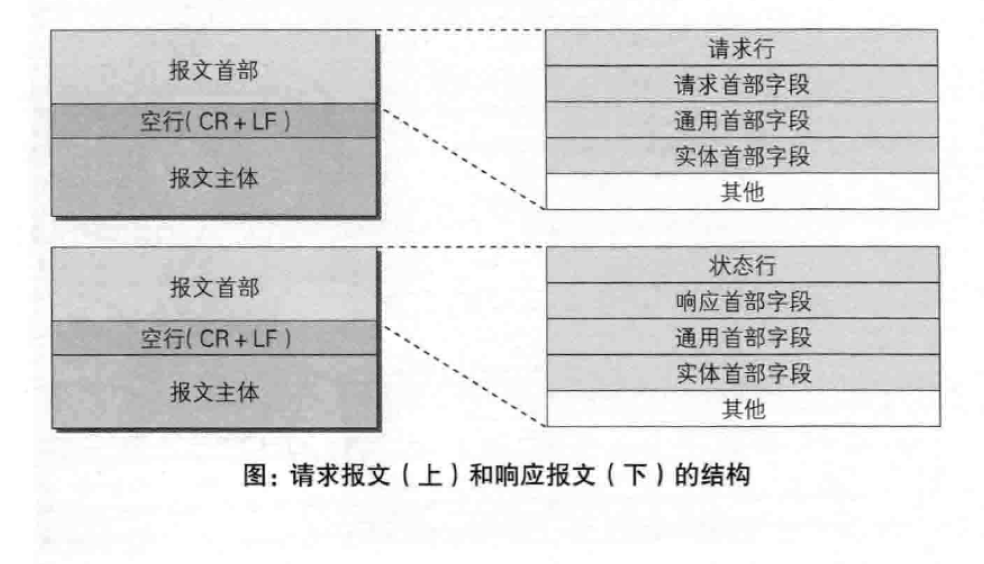
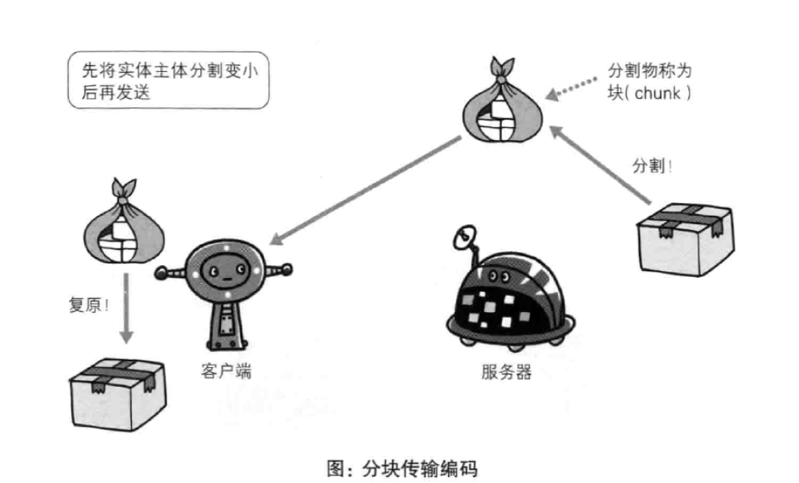
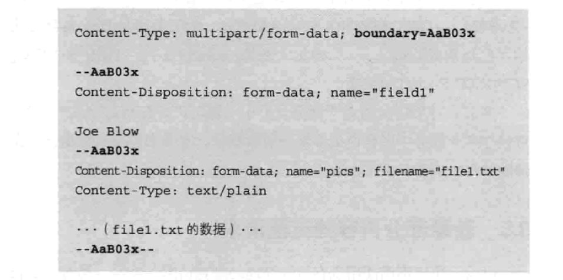
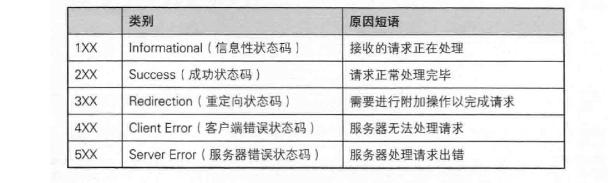
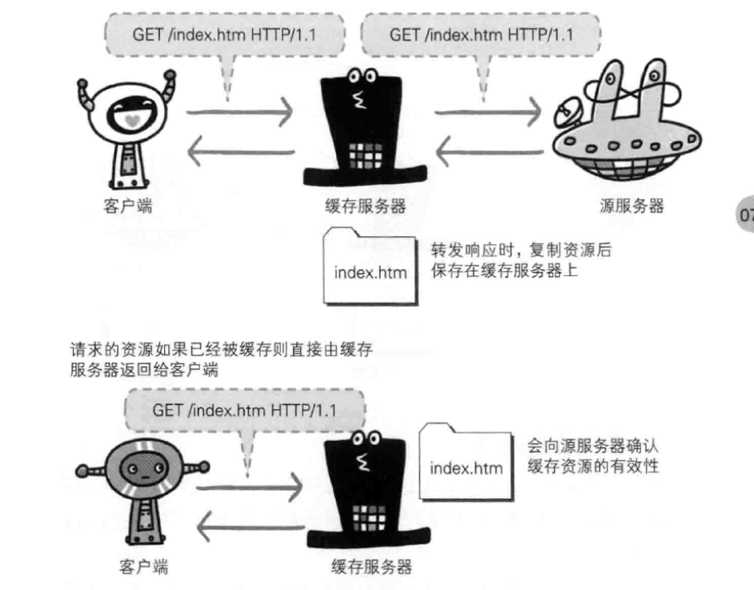

# HTTP报文内的HTTP信息

### HTTP报文
用于HTTP协议交互的信息被称为HTTP报文。请求端称请求报文，响应端称响应报文。报文大致分为报文首部和报文主体两个部分。

### 报文结构
请求报文和响应报文的结构：

* 请求行：包含请求方法，协议版本和URI
* 状态行：包含协议版本，状态码和原因短语
* 首部字段：包含请求和响应的各类首部，一般分4种，有请求首部，响应首部，实体首部和通用首部
* 其他：未被标准定义的首部（Cookie等）

### HTTP编码
HTTP可以在传输过程中通过编码来提升传输速率。编码工作由计算机来完成。
* 内容编码：只应用在报文实体上的编码，保持实体信息原样压缩，客户端接受压缩后的实体并解码。  

常用的内容编码：
    1. gzip（GUN zip）
    2. compress（UNIX系统的标准编码）
    3. deflate（zlib）
    4. identify（不进行编码）
* 分块传输编码：
将实体主体分割为多块，每一块用十六进制来标记大小，实体的最后一块采用“0（CR+LF）”来标记。客户端负责解码，将分块的实体恢复。

### 多部分对象集合
在表单提交，发送邮件等实际应用中，需要处理文本、图片等不同类型的数据。可以利用MIME来标记数据类型，容纳多种不同类型的数据，这种方法称为多部分对象集合（Multipart）。HTTP协议也采用这种方法来发送一份可能包含多种类型的实体。

# HTTP状态码
HTTP状态码表示客户端请求的返回结果，以三位数字和原因短语组成。数字中的第一位为响应类别：

### 2XX成功
* 200 OK：请求被正常处理。
* 204 No Content：请求成功处理，但返回的响应报文不包含实体主体部分。
* 206 Partical Content：表示客户端进行范围请求，服务器成功执行。

### 3XX重定向
* 301 moved permanently：永久性重定向。
* 302 Found：临时性重定向。

### 4X客户端错误
* 400 Bad Request：请求报文中存在语法错误。
* 401 Unauthorized：请求需要通过HTTP认证的认证信息。
* 403 Forbidden：对资源的访问被服务器拒绝。
* 404 Not Found：服务器无法找到请求的资源。

### 5XX服务器错误
* 500 Internal Server Error：服务器在执行请求时发生了错误。
* 503 Service Unavailable：服务器暂时处于超负载或正在停机维护。

# HTTP协作的WEB服务器
### 单机多域名
HTTP/1.1允许一台服务器搭建多个Web站点。只要使用虚拟主机的功能，就能在一台服务器上寄存不同主机名和域名的Web网站，在发送请求时，需要在HOST首部完整指定主机名或域名的URI。

### 通信数据转发程序
HTTP通信时，除了客户端和服务器，在通信数据转发是，还有一些应用程序配合服务器工作。
* 代理  
代理是具有转发功能的应用程序。

代理的基本行为是就收客户端的请求转发给其他服务器，在通信过程中，可以级联多台代理服务器。代理有多种使用方法，按两种基准分类，一种是是否使用缓存，一种是是否会修改报文。
    1. 缓存代理：预先将资源的副本保存在代理服务器上，当再次收到请求时，可以将缓存的资源返回。
    2. 透明代理： 不对报文做任何处理。
* 网关  
网关转发其他服务器通信数据，能像服务器一样处理请求。

网关和代理的机制非常相似，网关能使通信线路上的服务器提供非HTTP协议服务。
* 隧道  
在相隔很远的两端之间中转。

隧道可以使用SSL等加密手段进行通信，确报客户端和服务器进行安全的通信。隧道会在通信双方断开连接时结束。

### 资源缓存
资源缓存是指代理服务器或客户端本地磁盘内保存有资源的副本。利用缓存可以减少服务器访问次数。

缓存有有效时间，超过有效时间代理服务器或是客户端会向服务器重新确认资源。
