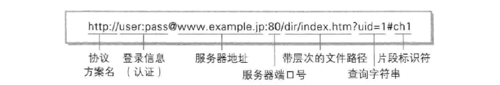
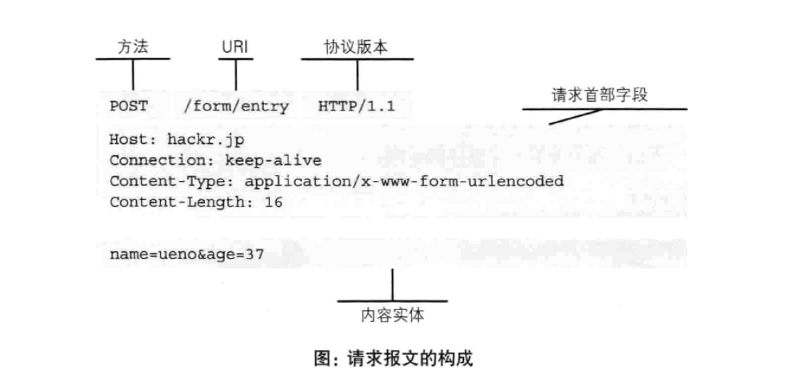
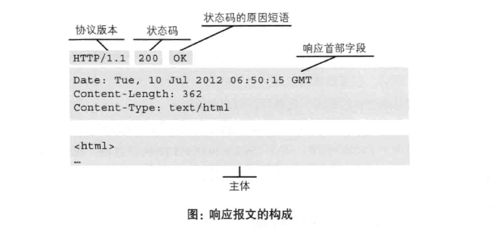
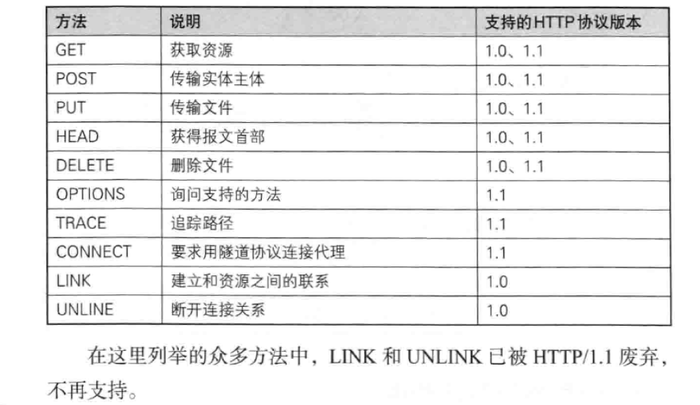
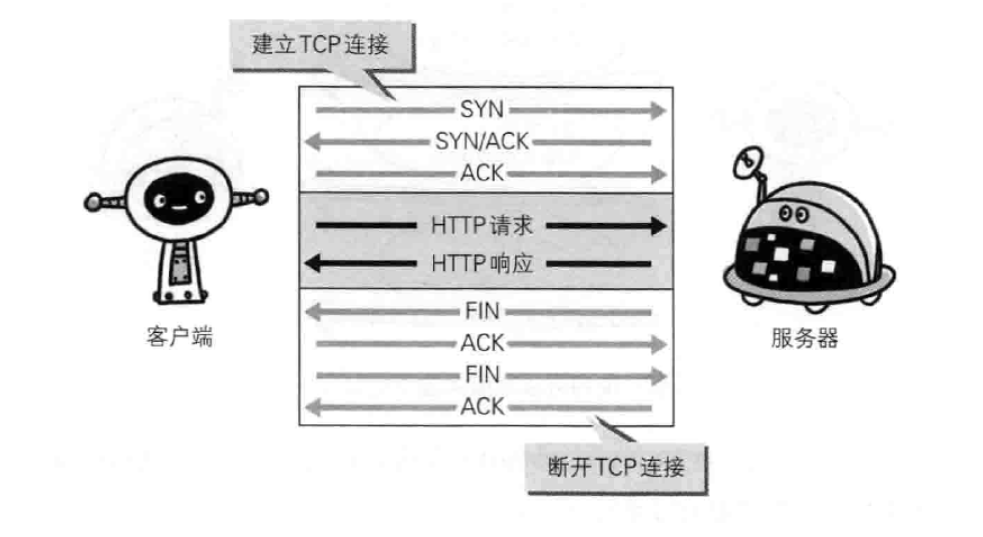
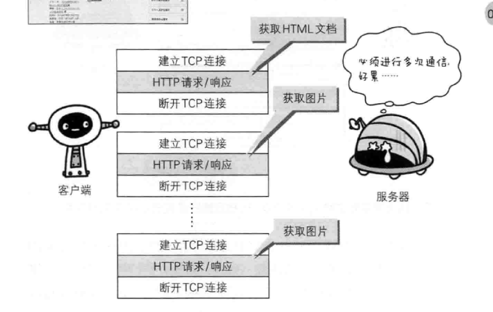
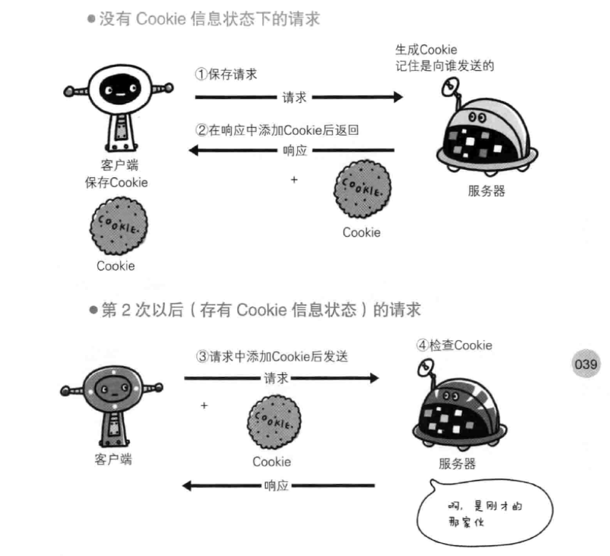

# 网络及http基础

### HTTP诞生
1989年在互联网还只是属于黎明时期时，人们为了实现远程共享知识而提出了www的构建概念，作为文档传输协议的http由此诞生。  
经历多次讨论，修改，当前主流的版本是1997年提出的HTTP/1.1。新一代的版本正在定制中。
### TCP/IP
将与互联网相关联的协议集合起来总称为TCP/IP。包括HTTP协议，DNS协议，IP协议，FTP协议等等。
##### TCP/IP四层结构
* 应用层：决定了向用户提供应用服务时通信的活动。HTTP协议位于此层。
* 传输层：提供处于网络连接中两台计算机之间的数据传输，包含两个协议：TCP、UDP。
* 网络层：确定网络连接的路径。
* 链路层：处理连接网络的硬件部分。

### 与HTTP关系密切的协议

##### IP
IP网际协议位于网络层。作用是将各种数据包传送给对方。有两个重要概念：
* IP地址：节点在网络中被分配的地址
* MAC地址：网卡所属的固定地址

##### TCP
TCP协议是位于传输层，提供可靠的字节流服务。也就是将大段的数据分割成以报文段为单位的数据包进行管理，并且能准确可靠的传输给对方。
TCP连接通过三次握手建立，四次握手断开。
##### DNS
DNS位于应用层，负责提供域名到IP地址的解析服务。

各种协议与HTTP协议的关系：

### 统一资源标识符URI
URI用字符串标识某一互联网资源，我们常说的URL（统一资源定位符）是它的子集。  
URI的格式：

### 请求和响应报文
* 请求报文：由请求方法、请求URI、协议版本、可选的请求首部字段和内容实体构成

* 响应报文：协议版本、状态码、状态码的原因短语、响应首部字段和主体构成

### HTTP/1.1中可使用的方法

### 持久连接
在早年的HTTP中，每进行一次HTTP通信都要断开一次TCP连接，为了节省通信量的开销HTTP/1.1中，所有连接默认都是持久连接，也就是只要任意一段没有明确提出断开连接，则TCP保持连接状态。

### 状态管理和Cookie
HTTP是一种无状态协议，意味着它不会保留之前的请求或响应信息，无法根据之前的状态进行本次的请求处理。随着web的发展，很多情况下我们需要实现保存状态功能，于是引入了Cookie技术。Cookie技术在请求和响应报文中写入Cookie信息来控制客户端状态。  
在客户端，Cookie会根据从服务器发送来的响应报文中的Set-Cookie首部信息来保存Cookie，下一次请求时，将保存的信息加在请求报文中发往服务器，服务器根据发来的Cookie信息得到之前的状态。

