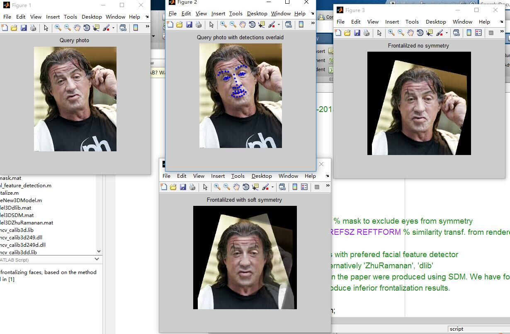
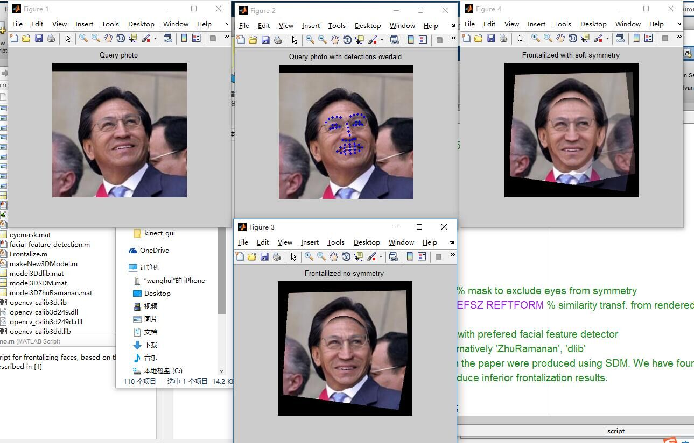

Effective Face Frontalization in Unconstrained Images  
在无约束图片中的有效人脸摆正
* Tal Hassner   
* Shai Harel   
* Eran Paz
* Roee Enbar

## 人脸摆正

  
"Frontalization"是将无约束的人脸照片和校正后的正脸合成的过程。研究发现图片经过这个过程后可以大幅提高人脸识别系统的性能和识别准确率。  
在最初的时候作者试图为每个输入图片建立一个3D模型，然后发现这种实现会很困难，而且容易引起面部失调。  
于是作者最终采用了一种更简单的方法，从标准正脸3D模型影射回2d图片然后采用对称复制的方法实现这个过程。    

## 完整过程

a：输入的原始图片，图中是一张人脸的侧脸图  
b：检测出人脸关键点  
c：用相同的人脸关键点算法检测出系统提供的标准正脸3D模型的关键点，生成一个3D计算机模型  
d、e：利用原始图片的人脸关键点坐标与其对应的标准正脸3D模型的关键点坐标，可以得出一个坐标投影矩阵，用于将原始图片的像素点反投影到标准正脸坐标系中    
f：将正脸图覆盖到原始图片后，计算出面部非正脸部分的可见性，热点图显示区域表示非正脸的像素，这些区域的图片借助正脸对称的位置显示  
g：输出的摆正后的正脸结果

## 人脸摆正中的重难点

#### 生成正脸图
人脸的检测使用现成的人脸关键点结果，然后借助标准的3D正脸模型坐标系统经行坐标调整。
* 面部特征检测：  
采用兼顾速度和特征检测准确性的SDM方法，画出的人脸关键点没有包括人的下巴，这些关键点会更接近3D平面的正面
* 姿态估算  
用相同的方法在标准3D正脸图中生成关键点，与原始图片的人脸关键点坐标比对，生成一个坐标投影矩阵，利用这个投影矩阵，反投影出原始图片的像素点，这些像素点将构成我们需要的正脸图。
* 合成正脸图  
 将得到的正脸图片覆盖到原始图片上。

#### 对称处理和可见度估算
对称处理：经过投影矩阵反投影后，会使得人脸的部分区域的可见度比其他地方更小，特别是鼻子和头部的边缘。这时需要做一些处理：  

a：输入图片  
b：在人脸特征点闭合的地方会出现类似涂抹拉伸的痕迹显得很模糊  
c：借助闭合检测和脸部对称输出的图片

可见度估算：使用类似于采用多视图三维重建的方法，使用一个与3D相似的模型和平面IR来计算IQ的可见度。

正脸坐标IR中的像素点q3和q4都被影射到输入图片的平面IQ上的像素点q，所以它们的可见度会更低。它们对称的点q1和q2用来预测他们在正面视图中应出现的位置。

a：输入图片  
b：计算覆盖在原始图片上的可见度，热点图表示可见度更少的区域  
c：对称后的正脸  
#### 进一步对称处理
对称处理能得到想要的结果，但是在一些特殊的图片中，因为脸部被遮挡的原因，还需要被进一步处理。

这两张图可以看出，对称处理后不是我们想要的结果，需要检测出对称的错误。  
当人脸的不可见部分是被除去人脸的遮挡物遮挡时，就需要在此基础上进行修正：

定位出标准脸的八个区域，主要对应嘴、鼻子和眼睛的周围区域，然后训练8个线性的SVM分类器，每一个分类器的训练图片是正视的人脸对应区域，由此得到LBP特征描述子，给定一张待矫正图片，对其进行同样的分块，用训练好的SVM分类器判断每块区域是否是可见部分，若是，则丢弃，若不是，则填充到前面生成的正脸图对应区域

#### 实际代码运行效果
系统提供的标准3D正脸图：  

实际运行效果：  

