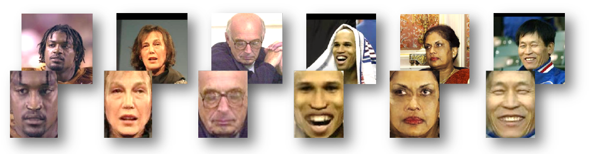
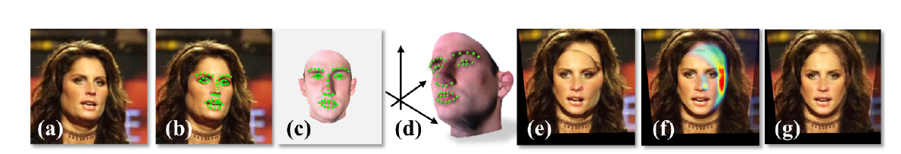
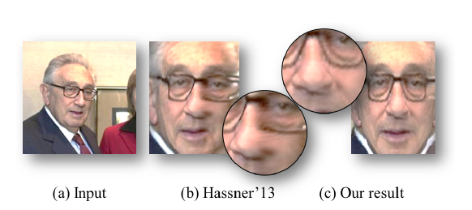
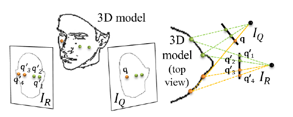
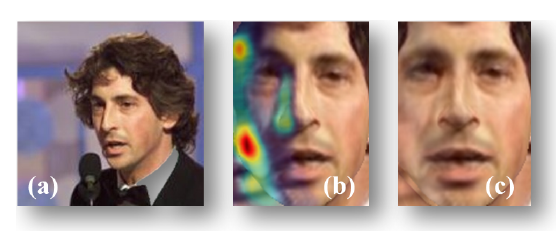
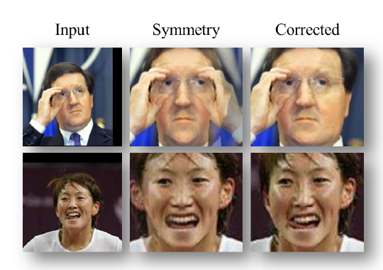

Effective Face Frontalization in Unconstrained Images  
在无约束图片中的有效人脸摆正
* Tal Hassner   
* Shai Harel   
* Eran Paz
* Roee Enbar

## 人脸摆正
  
"Frontalization"是将正脸和无约束的人脸照片合成的过程。研究发现这个过程可能会大幅提高人脸识别系统的性能。  
以前frontalization试图为每个输入图片建立一个3D模型，然后发现这种实现会很困难，而且用意引起面部失调。  
作者探索使用单一的更简单的方法给输入得图片建立近似三维的表面模型。    

## 完整过程

a：输入图片  
b：面部特征点检测  
c：点位输入图片的人脸特征点，用相同的特征点定位器标定由3D标准人脸模型生成的标准脸，渲染成一个3D计算机模型  
d、e：利用待矫正图片的2D坐标与其对应的3D模型坐标，可以得出一个投影矩阵，用于将待矫正图片的像素点反投影到标准坐标系  
f：正脸覆盖后，计算出面部非正脸部分的可见性，热点图表示非正脸的像素，这些区域的图片借助脸部对称的位置显示  
g：输出的正脸摆正结果

## 人脸摆正中的重难点
人脸的检测使用现成的特征检测结果，然后在正确的坐标系统中调整。
#### 生成正脸图
* 面部特征检测：  
采用兼顾速度和特征检测准确性的SDM方法，画出的面部特征点没有包括下巴，使得特征点接近3D平面的正面
* 姿态估算  
由2D特征点坐标和它对应的3D特征点坐标计算
* 合成正脸图  
 将像素点反投影到标准坐标系

#### 对称处理和可见度估算
头部的旋转会使得部分面部的可见度比其他地方更小，特别是鼻子和头部的边缘。这时需要做一些处理：  

a：输入图片  
b：在面部特征点闭合的地方会出现类似涂抹的痕迹  
c：借助闭合检测和脸部对称输出的图片

估算可见度：使用类似于采用多视图三维重建的方法，使用一个与3D相似的模型和平面IR来计算IQ的可见度。

参考坐标IR中的像素点q3和q4都被影射到输入图片的平面IQ上的像素点q，所以它们的可见度会更低。它们对称的点q1和q2用来预测他们在正面视图中应出现的位置。

a：输入图片  
b：计算覆盖在原始图片上的可见度，热点图表示可见度更少的区域  
c：对称后的正脸  
#### 进一步对称处理
对称处理能得到想要的结果，但是在一些特殊的图片中，还需要进一步处理。

这两张图可以看出，对称处理后不是我们想要的结果，需要检测出对称的错误。  
当人脸的不可见部分是被除去人脸的遮挡物遮挡时，就需要在此基础上进行修正：

定位出标准脸的八个区域，主要对应嘴、鼻子和眼睛的周围区域，然后训练8个线性的SVM分类器，每一个分类器的训练图片是正视的人脸对应区域，由此得到LBP特征描述子，给定一张待矫正图片，对其进行同样的分块，用训练好的SVM分类器判断每块区域是否是可见部分，若是，则丢弃，若不是，则填充到前面生成的正脸图对应区域
